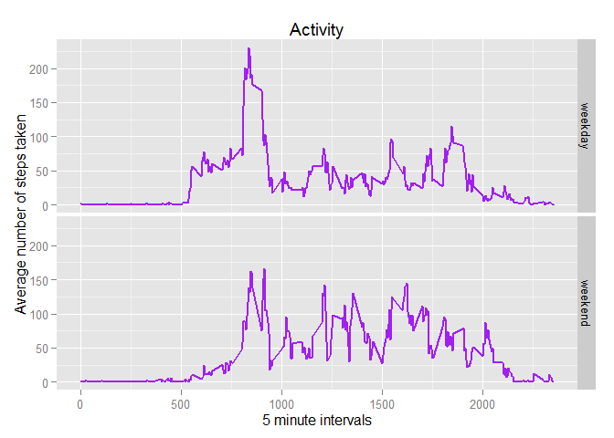

# Reproducible Research: Peer Assessment 1

## Loading and preprocessing the data

> Show any code that is needed to
>
> Load the data (i.e. read.csv())
>
> Process/transform the data (if necessary) into a format suitable for your analysis


```r
library(data.table)

unzip(zipfile = 'activity.zip')
dt_activity <- data.table(read.csv('activity.csv'))
dt_activity_Complete <- dt_activity[complete.cases(dt_activity), ]
```

## What is mean total number of steps taken per day?

> For this part of the assignment, you can ignore the missing values in the dataset.
> 
> Calculate the total number of steps taken per day
> 
> If you do not understand the difference between a histogram and a barplot, research the difference between them. Make a histogram of the total number of steps taken each day


```r
Tot_Steps <- aggregate(dt_activity_Complete$steps, list(dt_activity_Complete$date), FUN = sum)

names(Tot_Steps) <- c('Date', 'Steps')

library(ggplot2)
```

```
## Warning: package 'ggplot2' was built under R version 3.2.2
```

```r
qplot(Tot_Steps$Steps, binwidth = 1,
      xlab = 'Total number of steps taken per day',
      main = 'Activity') +
      geom_histogram(colour = 'Purple', fill = 'Purple')
```

```
## stat_bin: binwidth defaulted to range/30. Use 'binwidth = x' to adjust this.
```

 

```r
mean(Tot_Steps$Steps)
```

```
## [1] 10766.19
```

```r
median(Tot_Steps$Steps)
```

```
## [1] 10765
```

The **Mean** number of steps per day is **10,766.19**.

The **Median** number of steps per day is **10,765**.

## What is the average daily activity pattern?

> Make a time series plot (i.e. type = 'l') of the 5-minute interval (x-axis) and the average number of steps taken, averaged across all days (y-axis)


```r
Avg_Steps <- aggregate(x = list(steps = dt_activity$steps), by = list(interval = dt_activity$interval), FUN = mean, na.rm = TRUE)

ggplot(data = Avg_Steps,
       aes(x = interval, y = steps)) +
       geom_line(color = 'Purple', lwd = 1) +
       xlab('5-minute interval') +
       ylab('Average number of steps taken') + 
       labs(title = 'Activity')
```

 

On average across all the days in the dataset, which 5-minute interval contains the maximum number of steps?


```r
Avg_Steps[which.max(Avg_Steps$steps), ]
```

```
##     interval    steps
## 104      835 206.1698
```

The 5-minute interval that contains the maximum average number of steps is **8:35 AM** (ie. 835).

The maximum average number of steps is **206.1698**.

## Imputing missing values

> Devise a strategy for filling in all of the missing values in the dataset. The strategy does not need to be sophisticated. For example, you could use the mean/median for that day, or the mean for that 5-minute interval, etc.


```r
NAs_Missing <- is.na(dt_activity$steps)

# No. of NAs missing
table(NAs_Missing)
```

```
## NAs_Missing
## FALSE  TRUE 
## 15264  2304
```

> Create a new dataset that is equal to the original dataset but with the missing data filled in.


```r
# Replace each missing value with the mean value of its 5-minute interval
NA_Value <- function(steps, interval) {
    fill_val <- NA

    if (!is.na(steps))
        fill_val <- c(steps)
    else
        fill_val <- (Avg_Steps[Avg_Steps$interval == interval, 'steps'])
    return(fill_val)
}

dt_activity_Filled <- dt_activity
dt_activity_Filled$steps <- mapply(NA_Value, dt_activity_Filled$steps, dt_activity_Filled$interval)

head(dt_activity_Filled, 50L)
```

```
##         steps       date interval
##  1: 1.7169811 2012-10-01        0
##  2: 0.3396226 2012-10-01        5
##  3: 0.1320755 2012-10-01       10
##  4: 0.1509434 2012-10-01       15
##  5: 0.0754717 2012-10-01       20
##  6: 2.0943396 2012-10-01       25
##  7: 0.5283019 2012-10-01       30
##  8: 0.8679245 2012-10-01       35
##  9: 0.0000000 2012-10-01       40
## 10: 1.4716981 2012-10-01       45
## 11: 0.3018868 2012-10-01       50
## 12: 0.1320755 2012-10-01       55
## 13: 0.3207547 2012-10-01      100
## 14: 0.6792453 2012-10-01      105
## 15: 0.1509434 2012-10-01      110
## 16: 0.3396226 2012-10-01      115
## 17: 0.0000000 2012-10-01      120
## 18: 1.1132075 2012-10-01      125
## 19: 1.8301887 2012-10-01      130
## 20: 0.1698113 2012-10-01      135
## 21: 0.1698113 2012-10-01      140
## 22: 0.3773585 2012-10-01      145
## 23: 0.2641509 2012-10-01      150
## 24: 0.0000000 2012-10-01      155
## 25: 0.0000000 2012-10-01      200
## 26: 0.0000000 2012-10-01      205
## 27: 1.1320755 2012-10-01      210
## 28: 0.0000000 2012-10-01      215
## 29: 0.0000000 2012-10-01      220
## 30: 0.1320755 2012-10-01      225
## 31: 0.0000000 2012-10-01      230
## 32: 0.2264151 2012-10-01      235
## 33: 0.0000000 2012-10-01      240
## 34: 0.0000000 2012-10-01      245
## 35: 1.5471698 2012-10-01      250
## 36: 0.9433962 2012-10-01      255
## 37: 0.0000000 2012-10-01      300
## 38: 0.0000000 2012-10-01      305
## 39: 0.0000000 2012-10-01      310
## 40: 0.0000000 2012-10-01      315
## 41: 0.2075472 2012-10-01      320
## 42: 0.6226415 2012-10-01      325
## 43: 1.6226415 2012-10-01      330
## 44: 0.5849057 2012-10-01      335
## 45: 0.4905660 2012-10-01      340
## 46: 0.0754717 2012-10-01      345
## 47: 0.0000000 2012-10-01      350
## 48: 0.0000000 2012-10-01      355
## 49: 1.1886792 2012-10-01      400
## 50: 0.9433962 2012-10-01      405
##         steps       date interval
```

> Make a histogram of the total number of steps taken each day and Calculate and report the mean and median total number of steps taken per day.


```r
#Tot_Steps <- tapply(dt_activity_filled$steps, #dt_activity_filled$date, FUN = sum)

#qplot(Tot_Steps, binwidth = 1,
#      xlab = 'Total number of steps taken each day',
#      main = 'Activity') +
#      geom_histogram(colour = 'Purple', fill = 'Purple')

#mean(Tot_Steps)
#median(Tot_Steps)

Tot_Steps <- aggregate(dt_activity_Filled$steps, list(dt_activity_Filled$date), FUN = sum)

names(Tot_Steps) <- c('Date', 'Steps')

qplot(Tot_Steps$Steps, binwidth = 1,
      xlab = 'Total number of steps taken per day',
      main = 'Activity') +
      geom_histogram(colour = 'Purple', fill = 'Purple')
```

```
## stat_bin: binwidth defaulted to range/30. Use 'binwidth = x' to adjust this.
```

 

```r
mean(Tot_Steps$Steps)
```

```
## [1] 10766.19
```

```r
median(Tot_Steps$Steps)
```

```
## [1] 10766.19
```

The **Mean** number of steps per day is **10766.19**.

The **Median** number of steps per day is **10766.19**.

## Are there differences in activity patterns between weekdays and weekends?

> For this part the weekdays() function may be of some help here. Use the dataset with the filled-in missing values for this part.
>
> Create a new factor variable in the dataset with two levels - 'weekday' and 'weekend' indicating whether a given date is a weekday or weekend day.


```r
WkDayWkEnd <- function(date) {
    day <- weekdays(date)

    if (day %in% c('Monday', 'Tuesday', 'Wednesday', 'Thursday', 'Friday'))
       return('weekday')
    else if (day %in% c('Saturday', 'Sunday'))
       return('weekend')
    else
       stop('invalid date')
}

dt_activity_Filled$date <- as.Date(dt_activity_Filled$date)
dt_activity_Filled$day <- sapply(dt_activity_Filled$date, FUN = WkDayWkEnd)
```

> Make a panel plot containing a time series plot (i.e. type = 'l') of the 5-minute interval (x-axis) and the average number of steps taken, averaged across all weekday days or weekend days (y-axis). See the README file in the GitHub repository to see an example of what this plot should look like using simulated data.


```r
Avg_Steps <- aggregate(steps ~ interval + day, data = dt_activity_Filled, mean)

ggplot(Avg_Steps,
       aes(x = interval, y = steps)) +
       geom_line(color = 'Purple', lwd = 1) +
       facet_grid(day ~ .) +
       xlab('5-minute interval') +
       ylab('Number of steps') +
       labs(title = 'Activity')
```

 
